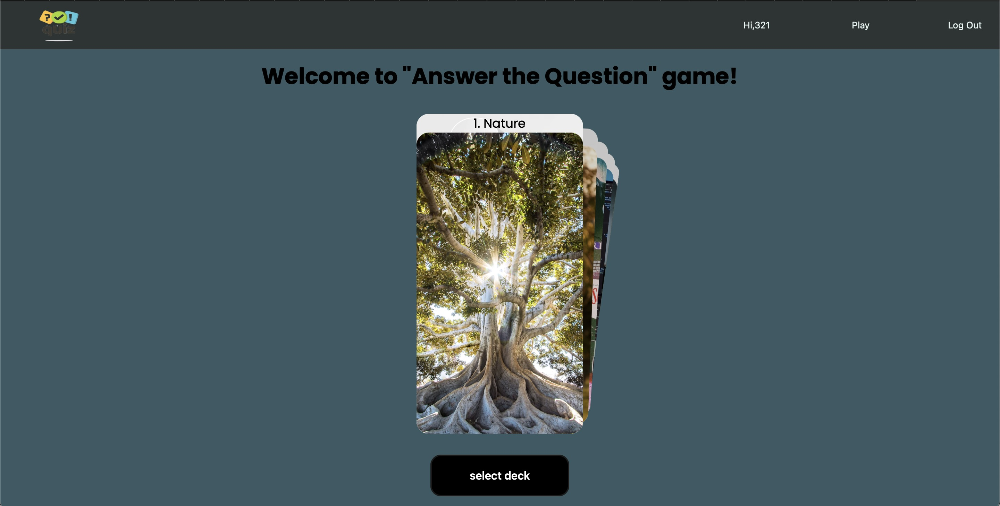

# Flash-cards-quiz-game

This is a training project done by me, aimed to provide you with a fun and engaging way to quiz yourself with various questions.

## Table of Contents

- [Demo](#Demo)
- [Features](#Features)
- [Instalation](#Instalation)
- [Technologies Used](#Technologies-Used)

## Demo

## Features

In this project, users can register and login. Users have a profile page where they can see their game statistics. Users can pick a theme for the quiz game and answer quiz questions. After the game, users can see the post-game stats.

## Instalation

To install this project, follow these steps:

1. Clone the repository: `git clone https://github.com/pprooxyy/Flash-cards-quiz-game`
2. Install the dependencies: `npm install`
3. Create a `.env` file and copy the contents from `.env-example`
4. Create the database and run migrations and seeds using `sequelize-cli: npx sequelize-cli db:create && npx sequelize-cli db:migrate && npx sequelize-cli db:seed:all`
5. Start the server: `npm run dev`
6. Access the server at `http://localhost:3001`

## Technologies Used

This project was built with:

- Express.js
- HTML
- CSS
- JavaScript
- Postgres
- Sequelize
- Slider.js
- React JSX Components
